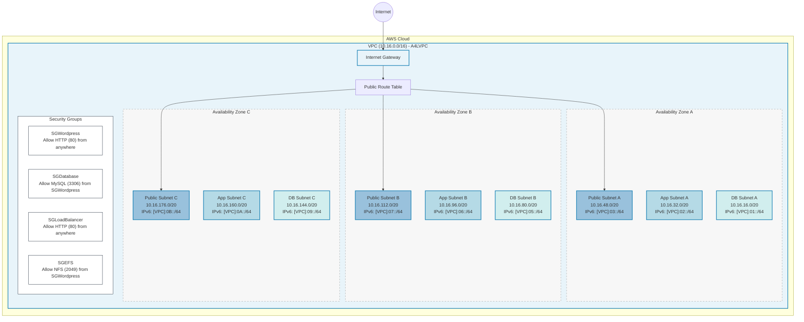

# WordPress VPC Architecture Diagram

This diagram illustrates the VPC architecture for the WordPress Evolution project designed for AWS SAA-03 exam preparation.

## Key Components

1. **VPC**: A dedicated virtual network with CIDR block 10.16.0.0/16
2. **Internet Gateway**: Provides internet connectivity to the VPC
3. **Three Availability Zones**: For high availability and fault tolerance
4. **Three-Tier Architecture**:
   - Public subnets (for load balancers)
   - Application subnets (for WordPress)
   - Database subnets (for database instances)
5. **Security Groups**:
   - WordPress security group (HTTP traffic)
   - Database security group (MySQL traffic)
   - Load Balancer security group (HTTP traffic)
   - EFS security group (NFS traffic)

## Exam Tips

- This architecture demonstrates **high availability** across multiple AZs
- IPv6 is configured throughout the entire infrastructure
- Security groups are designed with **least privilege** access
- The three-tier design allows for proper **isolation of resources**
- Public subnets have direct internet access, while app and DB tiers are more protected